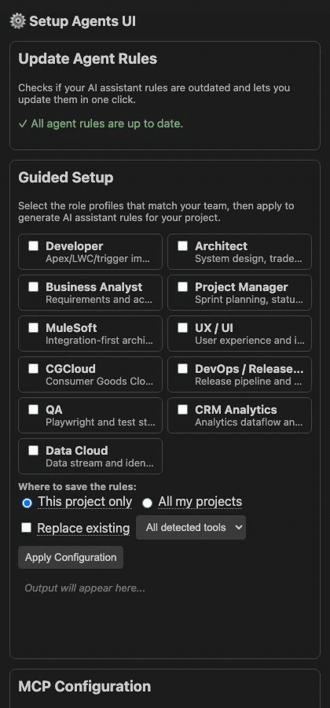
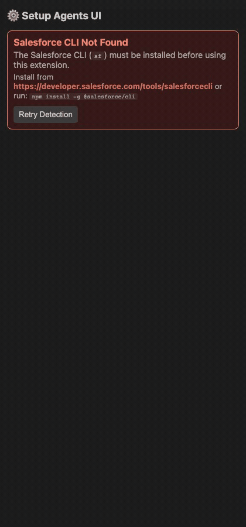
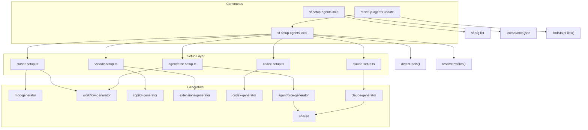

# setup-agents ⚡ — Salesforce CLI Plugin

> Bootstrap AI agent rules and role profiles for any Salesforce project in seconds.

[](https://npmjs.org/package/@jterrats/setup-agents)
[](https://github.com/jterrats/setup-agents/actions)
[](https://github.com/jterrats/setup-agents/blob/main/LICENSE.txt)
[](https://nodejs.org)

> **Disclaimer:** This is a **personal open-source project** by [Jaime Terrats](https://github.com/jterrats). It is **not** an official Salesforce product, nor is it endorsed, supported, or affiliated with Salesforce, Inc. Use at your own discretion.

---

## About

`setup-agents` is a Salesforce CLI plugin that sets up AI coding assistant rules and role-based profiles for any project. One command configures [Cursor](https://cursor.sh), [GitHub Copilot](https://code.visualstudio.com/docs/copilot/overview), [OpenAI Codex CLI](https://github.com/openai/codex), [Anthropic Claude Code](https://docs.anthropic.com/en/docs/claude-code), and [Agentforce Vibes](https://developer.salesforce.com/docs/platform/einstein-for-devs/guide/devagent-rules.html) simultaneously — with rules tailored to the specific roles working in the project.

- **11 role profiles** — Developer, Architect, BA, PM, MuleSoft, UX, CGCloud, DevOps, QA, CRMA, Data Cloud
- **VS Code Extension** — visual sidebar UI for guided setup, MCP config, integrations, and rule management
- **3 AI skills** — Story Mapping, Diagram Export (Lucid/draw.io/local), Deploy & Validate
- **Auto-detection** — detects `cgcloud__`, `WaveDashboard`, `DataStream`, Playwright config, and more
- **Sub-agent orchestration** — generates a `sub-agent-protocol.mdc` mapping tasks to roles
- **Extension recommendations** — writes `.vscode/extensions.json` with profile-specific extensions
- **Combinable profiles** — `--profile developer,architect,crma` stacks rules from all selected roles
- **Agentforce Workflows** — generates `.a4drules/workflows/*.md` for automated dev tasks (deploy, test, ADR, etc.)
- **MCP integration** — `sf setup-agents mcp` wires `@salesforce/mcp` into Cursor for any Salesforce org, with interactive login when no orgs are authenticated
- **Scope control** — Cursor rules can be written at project level (`.cursor/rules/`) or user level (`~/.cursor/rules/`)
- **Safe by default** — never overwrites existing rule files without `--force`

---

## Quick Start

```sh
# Install the plugin
sf plugins install @jterrats/setup-agents

# Run in your Salesforce project
cd my-salesforce-project
sf setup-agents local
```

The command auto-detects your tools and prompts for role selection:

```
? Select your role profile(s):
❯◉ Developer
 ◯ Architect
 ◯ Business Analyst
 ◯ Project Manager
 ◯ MuleSoft
 ◯ UX / UI
 ◉ CGCloud  ← pre-selected (cgcloud__ detected)
 ◯ DevOps / Release Manager
 ◯ QA (Playwright)
 ◯ CRM Analytics Engineer (CRMA)
 ◯ Data Cloud Architect / Engineer (Data 360)
```

> **Unsigned Plugin Notice:**
> You will be prompted the first time you install an unsigned plugin. To trust this plugin:
>
> ```sh
> sf plugins install @jterrats/setup-agents --no-verify
> # or add to allowlist in ~/.config/sf/unsignedPluginAllowList.json
> ```

### VS Code Extension (Preview)

A visual sidebar UI that wraps the CLI plugin for teams that prefer point-and-click over terminal commands.

<p align="center">
  
</p>

**Features:**

- **Guided Setup** — auto-detects tools, displays 11 profile cards, scope selector, live console output
- **MCP Configuration** — lists authenticated orgs, pre-selects already-connected ones, one-click connect
- **Third-Party Integrations** — profile-filtered cards for Figma, Jira, draw.io, GitHub with credential input
- **Update Agent Rules** — detects stale files and updates in one click
- **Rule Management** — import from URL/file, browse, edit, and save rule files inline
- **Health Checks** — verifies SF CLI and plugin installation with actionable error banners

<details>
<summary>SF CLI not installed?</summary>
<p align="center">
  
</p>
</details>

```sh
cd extensions/vscode-setup-agents-ui
npm install && npm run build
# Then press F5 or open the Setup Agents sidebar in VS Code
```

> **Full documentation:** see the [Extension page](https://jterrats.github.io/setup-agents/extension/) on the docs site.

---

## Architecture



### Files generated per tool

| Tool           | Files                                                                                                                         |
| -------------- | ----------------------------------------------------------------------------------------------------------------------------- |
| **Cursor**     | `.cursor/rules/agent-guidelines.mdc`, `salesforce-standards.mdc`, `<profile>-standards.mdc`, `sub-agent-protocol.mdc`         |
| **VS Code**    | `.github/copilot-instructions.md`, `.vscode/extensions.json`                                                                  |
| **Codex**      | `AGENTS.md`                                                                                                                   |
| **Claude**     | `CLAUDE.md`                                                                                                                   |
| **Agentforce** | `.a4drules/00-base-guidelines.md`, `01-salesforce-standards.md`, `<profile>.md`, `99-sub-agent-protocol.md`, `workflows/*.md` |

---

## Profiles

Each profile generates a dedicated `.mdc` rule file in `.cursor/rules/` and contributes extensions to `.vscode/extensions.json`.

| Profile              | Flag        | Rule File                 | Auto-detect Signal                                |
| -------------------- | ----------- | ------------------------- | ------------------------------------------------- |
| **Developer**        | `developer` | `developer-standards.mdc` | —                                                 |
| **Architect**        | `architect` | `architect-standards.mdc` | —                                                 |
| **Business Analyst** | `ba`        | `ba-standards.mdc`        | —                                                 |
| **Project Manager**  | `pm`        | `pm-standards.mdc`        | —                                                 |
| **MuleSoft**         | `mulesoft`  | `mulesoft-standards.mdc`  | `mule-artifact.json` / `pom.xml`                  |
| **UX / UI**          | `ux`        | `ux-standards.mdc`        | —                                                 |
| **CGCloud**          | `cgcloud`   | `cgcloud-standards.mdc`   | `cgcloud__` in `package.xml`                      |
| **DevOps**           | `devops`    | `devops-standards.mdc`    | `azure-pipelines.yml`                             |
| **QA**               | `qa`        | `qa-standards.mdc`        | `playwright.config.ts/js`                         |
| **CRM Analytics**    | `crma`      | `analytics-standards.mdc` | `WaveDashboard` / `WaveDataflow` in `package.xml` |
| **Data Cloud**       | `data360`   | `data360-standards.mdc`   | `DataStream` / `DataModelObject` in `package.xml` |

Profiles are **combinable**. All rules use `alwaysApply: true` so every AI agent in the project has full context.

---

## Sub-agent Protocol

When multiple profiles are active, `sf setup-agents local` generates `.cursor/rules/sub-agent-protocol.mdc` — a routing manifest that tells AI agents which role handles which task type:

```
## Active Profiles
| Role                          | Rule File                  |
|-------------------------------|----------------------------|
| Developer                     | developer-standards.mdc    |
| Analytics Engineer (CRMA)     | analytics-standards.mdc    |
| Data Cloud Engineer           | data360-standards.mdc      |

## Task-to-Profile Routing
| Task Type                              | Assigned Role       |
|----------------------------------------|---------------------|
| Apex / LWC / Triggers                  | Developer           |
| Recipes / Dataflows / SAQL             | Analytics Engineer  |
| Data Streams / Identity Resolution     | Data Cloud Engineer |
```

---

## Agentforce Workflows

When `--rules agentforce` is used on a Salesforce project, the plugin generates workflow files in `.a4drules/workflows/` that can be invoked in the Agentforce Vibes extension chat with `/[workflow-name.md]`.

| Workflow                  | Trigger   | Description                                   |
| ------------------------- | --------- | --------------------------------------------- |
| `deploy.md`               | Always    | Guided Salesforce component deploy            |
| `run-tests.md`            | Always    | Run Apex test classes with coverage           |
| `validate.md`             | Always    | Validate-only deploy (CI-safe)                |
| `create-apex-class.md`    | Developer | Create Apex class following project standards |
| `create-lwc.md`           | Developer | Scaffold LWC with SLDS best practices         |
| `create-trigger.md`       | Developer | Create trigger using Kevin O'Hara pattern     |
| `adr.md`                  | Architect | Architecture Decision Record template         |
| `release.md`              | DevOps    | Release checklist and deployment plan         |
| `create-scratch-org.md`   | DevOps    | Scratch org setup with permission sets        |
| `run-playwright.md`       | QA        | Run Playwright tests and capture report       |
| `generate-test-report.md` | QA        | Generate test coverage report                 |
| `sprint-plan.md`          | PM        | Create sprint plan with Gantt timeline        |
| `status-report.md`        | PM        | Generate weekly status report                 |
| `risk-register.md`        | PM        | Maintain project risk register                |
| `deploy-analytics.md`     | CRMA      | Deploy CRM Analytics dashboards and dataflows |

---

## AI Skills

The plugin generates reusable AI skills (`.cursor/skills/` for Cursor, portable markdown for other tools) for profiles that need them.

| Skill                 | Generated For                | Description                                                                                      |
| --------------------- | ---------------------------- | ------------------------------------------------------------------------------------------------ |
| **Story Mapping**     | BA, PM, Architect            | Jeff Patton–style story maps rendered as Mermaid diagrams (PDF)                                  |
| **Deploy & Validate** | Developer, Architect, DevOps | Guided deploy/validate using `@jterrats/profiler` and `@jterrats/smart-deployment` plugins       |
| **Diagram Export**    | BA, PM, Architect, Developer | Export Mermaid diagrams to Lucidchart (API), draw.io (XML), or local SVG/PDF with auto-detection |

---

## Install

```sh
sf plugins install @jterrats/setup-agents
```

### Requirements

- Salesforce CLI (`sf`) v2+
- Node.js >= 18

---

## Commands

<!-- commands -->

- [`sf setup-agents local`](#sf-setup-agents-local)
- [`sf setup-agents mcp`](#sf-setup-agents-mcp)
- [`sf setup-agents update`](#sf-setup-agents-update)

## `sf setup-agents local`

Configure AI agent rules for the local development environment.

```
USAGE
  $ sf setup-agents local [--json] [--flags-dir <value>] [--rules cursor|vscode|codex|claude|agentforce] [--profile
    developer|architect|ba|pm|mulesoft|ux|cgcloud|devops|qa|crma|data360] [-f]

FLAGS
  -f, --force                                                                         Overwrite existing rule files.
      --profile=developer|architect|ba|pm|mulesoft|ux|cgcloud|devops|qa|crma|data360  Role profiles to configure
                                                                                      (comma-separated).
      --rules=cursor|vscode|codex|claude|agentforce                                Target AI tool to configure (cursor,
                                                                                   vscode, codex, claude, agentforce).

GLOBAL FLAGS
  --flags-dir=<value>  Import flag values from a directory.
  --json               Format output as json.

DESCRIPTION
  Configure AI agent rules for the local development environment.

  Sets up agent rule files for AI coding assistants in the current project directory.

  Supported tools:

  - **cursor** — Creates `.cursor/rules/agent-guidelines.mdc` and per-profile rule files for Cursor AI.
  - **vscode** — Creates `.github/copilot-instructions.md` and `.vscode/extensions.json` for GitHub Copilot.
  - **codex** — Creates `AGENTS.md` for OpenAI Codex CLI.
  - **claude** — Creates `CLAUDE.md` for Anthropic Claude Code.
  - **agentforce** — Creates `.a4drules/` numbered markdown files for Agentforce Vibes Extension.

  If `--rules` is omitted, the command auto-detects installed tools based on existing directories
  (`.cursor`, `.vscode`, `AGENTS.md`, `CLAUDE.md`, `.a4drules`). If none are detected, all tools are configured.

  If `--profile` is omitted, the command auto-detects profiles from the project structure and
  presents a selection prompt. If nothing is selected, the `developer` profile is used by default.

  Use `--force` to overwrite existing files (useful when running `sf setup-agents update` under the hood).

EXAMPLES
  Configure all detected AI tools with interactive profile selection:

    $ sf setup-agents local

  Configure only Cursor rules:

    $ sf setup-agents local --rules cursor

  Configure only GitHub Copilot instructions for VS Code:

    $ sf setup-agents local --rules vscode

  Configure only Codex (AGENTS.md):

    $ sf setup-agents local --rules codex

  Configure Claude Code (CLAUDE.md):

    $ sf setup-agents local --rules claude

  Configure Agentforce Vibes rules:

    $ sf setup-agents local --rules agentforce

  Configure with a specific profile:

    $ sf setup-agents local --profile developer

  Configure with multiple combined profiles:

    $ sf setup-agents local --profile developer,architect,cgcloud

  Configure QA automation profile:

    $ sf setup-agents local --profile qa

  Force overwrite all existing rule files:

    $ sf setup-agents local --force

FLAG DESCRIPTIONS
  -f, --force  Overwrite existing rule files.

    Force overwrite of all generated files, even if they already exist.
    Use this flag after updating your profiles or when the plugin version has changed.

  --profile=developer|architect|ba|pm|mulesoft|ux|cgcloud|devops|qa|crma|data360

    Role profiles to configure (comma-separated).

    Specify one or more role profiles as a comma-separated list. Each profile generates a dedicated
    rule file with role-specific agent guidance and adds the relevant VS Code extensions.

    Valid profiles: developer, architect, ba, pm, mulesoft, ux, cgcloud, devops, qa, crma, data360

    When omitted, the command auto-detects profiles from the project structure and presents an
    interactive multi-select prompt. If no profile is selected, `developer` is used as the default.

  --rules=cursor|vscode|codex|claude|agentforce  Target AI tool to configure (cursor, vscode, codex, claude, agentforce).

    Specify which AI coding assistant to configure. Valid options are `cursor`, `vscode`, `codex`, `claude`, or
    `agentforce`.
    When omitted, the command auto-detects tools present in the project; if none are found, all tools are configured.
```

_See code: [src/commands/setup-agents/local.ts](https://github.com/jterrats/setup-agents/blob/v1.1.1/src/commands/setup-agents/local.ts)_

## `sf setup-agents mcp`

Configure Cursor MCP servers for Salesforce orgs.

```
USAGE
  $ sf setup-agents mcp [--json] [--flags-dir <value>] [--target-org myOrgAlias] [--profile
    developer|architect|ba|pm|mulesoft|ux|cgcloud|devops|qa|crma|data360] [--all-toolsets] [-g]

FLAGS
  -g, --global                                                                        Write to the global
                                                                                      ~/.cursor/mcp.json instead of the
                                                                                      project-level .cursor/mcp.json.
      --all-toolsets                                                                  Enable all MCP toolsets regardless of
                                                                                      profile.
      --profile=developer|architect|ba|pm|mulesoft|ux|cgcloud|devops|qa|crma|data360  Role profile(s) used to determine MCP
                                                                                      toolsets.
      --target-org=myOrgAlias                                                      Salesforce org alias or username to
                                                                                   configure.

GLOBAL FLAGS
  --flags-dir=<value>  Import flag values from a directory.
  --json               Format output as json.

DESCRIPTION
  Configure Cursor MCP servers for Salesforce orgs.

  Sets up Cursor's Micro-Agent Collaboration Protocol (MCP) configuration for one or more
  Salesforce orgs using `@salesforce/mcp`. This allows Cursor AI to interact directly with
  your Salesforce org metadata, data, users, and testing tools via tool calls.

  The command writes (or merges into) a `.cursor/mcp.json` file with an MCP server entry per
  selected org. Use `--global` to write to the user-level `~/.cursor/mcp.json` instead.

  Toolsets included by default (based on profile):

  - **metadata** — SFDX metadata read/deploy tools.
  - **data** — SOQL and org data inspection tools.
  - **testing** — Apex and project testing tools.
  - **users** — permission set and user management tools.

  If `--target-org` is omitted, all authenticated orgs are listed for interactive selection.
  If no orgs are authenticated, the command offers an interactive web login flow — prompts for
  an alias, opens `sf org login web`, and waits for authentication to complete before proceeding.

EXAMPLES
  Configure MCP for all authenticated orgs (interactive):

    $ sf setup-agents mcp

  Configure MCP for a specific org:

    $ sf setup-agents mcp --target-org myOrgAlias

  Configure MCP globally (all projects):

    $ sf setup-agents mcp --global --target-org myOrgAlias

  Configure MCP with toolsets for the developer profile:

    $ sf setup-agents mcp --profile developer --target-org myOrgAlias

  Configure MCP with all toolsets:

    $ sf setup-agents mcp --all-toolsets --target-org myOrgAlias

FLAG DESCRIPTIONS
  -g, --global  Write to the global ~/.cursor/mcp.json instead of the project-level .cursor/mcp.json.

    When set, the MCP server entries are added to `~/.cursor/mcp.json`, making them available
    across all Cursor projects on this machine.

  --all-toolsets  Enable all MCP toolsets regardless of profile.

    Force-enable all available MCP toolsets for every org configured.

  --profile=developer|architect|ba|pm|mulesoft|ux|cgcloud|devops|qa|crma|data360

    Role profile(s) used to determine MCP toolsets.

    Comma-separated list of role profiles. Each profile maps to a subset of MCP toolsets.
    If omitted, all available MCP toolsets are enabled.

  --target-org=myOrgAlias  Salesforce org alias or username to configure.

    Specify a single org alias or username. An MCP server entry will be added for this org.
    Omit to select from all authenticated orgs interactively.
```

_See code: [src/commands/setup-agents/mcp.ts](https://github.com/jterrats/setup-agents/blob/v1.1.1/src/commands/setup-agents/mcp.ts)_

## `sf setup-agents update`

Update stale AI agent rule files to the current plugin version.

```
USAGE
  $ sf setup-agents update [--json] [--flags-dir <value>] [--dry-run] [-y]

FLAGS
  -y, --yes      Skip confirmation prompt.
      --dry-run  Preview changes without writing any files.

GLOBAL FLAGS
  --flags-dir=<value>  Import flag values from a directory.
  --json               Format output as json.

DESCRIPTION
  Update stale AI agent rule files to the current plugin version.

  Scans the current project for rule files generated by `sf setup-agents local` and re-generates any
  files whose embedded `pluginVersion` (or `<!-- setup-agents: -->` comment) does not match the
  current plugin version.

  Detection logic:

  - `.cursor/rules/*.mdc` — checks `pluginVersion:` in frontmatter.
  - `.github/copilot-instructions.md` — checks `<!-- setup-agents: x.y.z -->` comment.
  - `AGENTS.md` — checks `<!-- setup-agents: x.y.z -->` comment.
  - `CLAUDE.md` — checks `<!-- setup-agents: x.y.z -->` comment.
  - `.a4drules/*.md` — checks `<!-- setup-agents: x.y.z -->` comment.

  Active profiles are inferred from the filenames in `.cursor/rules/` (e.g. `developer-standards.mdc`
  maps to the `developer` profile). Use `--dry-run` to preview changes without writing files.

EXAMPLES
  Preview which rule files are stale:

    $ sf setup-agents update --dry-run

  Update all stale files with confirmation:

    $ sf setup-agents update

  Update all stale files without prompting (CI mode):

    $ sf setup-agents update --yes

FLAG DESCRIPTIONS
  -y, --yes  Skip confirmation prompt.

    Automatically confirm the update without interactive prompting.
    Useful in CI/CD pipelines or scripted environments.

  --dry-run  Preview changes without writing any files.

    List all stale files that would be updated without actually modifying them.
    Useful to audit what would change before committing to an update.
```

_See code: [src/commands/setup-agents/update.ts](https://github.com/jterrats/setup-agents/blob/v1.1.1/src/commands/setup-agents/update.ts)_

<!-- commandsstop -->

---

## Build

### Local Development

```sh
# Clone and install
git clone https://github.com/jterrats/setup-agents.git
cd setup-agents
npm install

# Compile
npx tsc -p .

# Link for local testing
sf plugins link .
sf setup-agents local
```

### Running Tests

```sh
# Unit tests (225 specs)
node --loader ts-node/esm --no-warnings=ExperimentalWarning \
  ./node_modules/mocha/bin/mocha.js "test/**/*.test.ts"

# End-to-end tests (requires sf CLI in PATH)
npm run test:e2e

# Full suite (lint + compile + tests)
npm test
```

### Extension Development

```sh
cd extensions/vscode-setup-agents-ui
npm install && npm run build

# E2E tests (27 Playwright specs)
npm run test:e2e

# Generate demo GIFs (requires ffmpeg)
npm run demo
```

### Package Validation Before Publish

```sh
# Build from a clean state
yarn clean-all
yarn build

# Validate npm tarball includes compiled commands/profiles
npm pack --dry-run
```

Confirm the dry-run output includes at least:

- `lib/commands/setup-agents/local.js`
- `lib/commands/setup-agents/mcp.js`
- `lib/commands/setup-agents/update.js`
- `lib/profiles/index.js`

---

## Contributing

1. Fork the repository
2. Create a branch: `git checkout -b feature/my-feature`
3. Make your changes and add tests
4. Run `npm test` to ensure everything passes
5. Open a pull request on [GitHub](https://github.com/jterrats/setup-agents)

Please open an [issue](https://github.com/jterrats/setup-agents/issues) before starting work on large features.

---

## License

Apache-2.0 — see [LICENSE.txt](LICENSE.txt).

---

<div align="center">
  Built by <strong>Jaime Terrats</strong> · <a href="https://github.com/jterrats/setup-agents">GitHub</a>
  <br>
  <sub>This is a personal open-source project, not an official Salesforce product.</sub>
</div>
