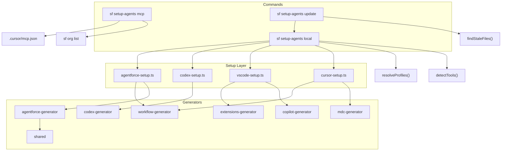

# setup-agents ⚡ — Salesforce CLI Plugin

> Bootstrap AI agent rules and role profiles for any Salesforce project in seconds.

[](https://npmjs.org/package/@jterrats/setup-agents)
[](https://github.com/jterrats/setup-agents/actions)
[](https://github.com/jterrats/setup-agents/blob/main/LICENSE.txt)
[](https://nodejs.org)

---

## About

`setup-agents` is a Salesforce CLI plugin that sets up AI coding assistant rules and role-based profiles for any project. One command configures [Cursor](https://cursor.sh), [GitHub Copilot](https://code.visualstudio.com/docs/copilot/overview), [OpenAI Codex CLI](https://github.com/openai/codex), and [Agentforce Vibes](https://developer.salesforce.com/docs/platform/einstein-for-devs/guide/devagent-rules.html) simultaneously — with rules tailored to the specific roles working in the project.

- **10 role profiles** — Developer, Architect, BA, MuleSoft, UX, CGCloud, DevOps, QA, CRMA, Data Cloud
- **Auto-detection** — detects `cgcloud__`, `WaveDashboard`, `DataStream`, Playwright config, and more
- **Sub-agent orchestration** — generates a `sub-agent-protocol.mdc` mapping tasks to roles
- **Extension recommendations** — writes `.vscode/extensions.json` with profile-specific extensions
- **Combinable profiles** — `--profile developer,architect,crma` stacks rules from all selected roles
- **Agentforce Workflows** — generates `.a4drules/workflows/*.md` for automated dev tasks (deploy, test, ADR, etc.)
- **MCP integration** — `sf setup-agents mcp` wires `@salesforce/mcp` into Cursor for any Salesforce org
- **Safe by default** — never overwrites existing rule files without `--force`

---

## Quick Start

```sh
# Install the plugin
sf plugins install @jterrats/setup-agents

# Run in your Salesforce project
cd my-salesforce-project
sf setup-agents local
```

The command auto-detects your tools and prompts for role selection:

```
? Select your role profile(s):
❯◉ Developer
 ◯ Architect
 ◯ Business Analyst
 ◯ MuleSoft
 ◯ UX / UI
 ◉ CGCloud  ← pre-selected (cgcloud__ detected)
 ◯ DevOps / Release Manager
 ◯ QA (Playwright)
 ◯ CRM Analytics Engineer (CRMA)
 ◯ Data Cloud Architect / Engineer (Data 360)
```

> **Unsigned Plugin Notice:**
> You will be prompted the first time you install an unsigned plugin. To trust this plugin:
>
> ```sh
> sf plugins install @jterrats/setup-agents --no-verify
> # or add to allowlist in ~/.config/sf/unsignedPluginAllowList.json
> ```

---

## Architecture



### Files generated per tool

| Tool           | Files                                                                                                                         |
| -------------- | ----------------------------------------------------------------------------------------------------------------------------- |
| **Cursor**     | `.cursor/rules/agent-guidelines.mdc`, `salesforce-standards.mdc`, `<profile>-standards.mdc`, `sub-agent-protocol.mdc`         |
| **VS Code**    | `.github/copilot-instructions.md`, `.vscode/extensions.json`                                                                  |
| **Codex**      | `AGENTS.md`                                                                                                                   |
| **Agentforce** | `.a4drules/00-base-guidelines.md`, `01-salesforce-standards.md`, `<profile>.md`, `99-sub-agent-protocol.md`, `workflows/*.md` |

---

## Profiles

Each profile generates a dedicated `.mdc` rule file in `.cursor/rules/` and contributes extensions to `.vscode/extensions.json`.

| Profile              | Flag        | Rule File                 | Auto-detect Signal                                |
| -------------------- | ----------- | ------------------------- | ------------------------------------------------- |
| **Developer**        | `developer` | `developer-standards.mdc` | —                                                 |
| **Architect**        | `architect` | `architect-standards.mdc` | —                                                 |
| **Business Analyst** | `ba`        | `ba-standards.mdc`        | —                                                 |
| **MuleSoft**         | `mulesoft`  | `mulesoft-standards.mdc`  | `mule-artifact.json` / `pom.xml`                  |
| **UX / UI**          | `ux`        | `ux-standards.mdc`        | —                                                 |
| **CGCloud**          | `cgcloud`   | `cgcloud-standards.mdc`   | `cgcloud__` in `package.xml`                      |
| **DevOps**           | `devops`    | `devops-standards.mdc`    | `azure-pipelines.yml`                             |
| **QA**               | `qa`        | `qa-standards.mdc`        | `playwright.config.ts/js`                         |
| **CRM Analytics**    | `crma`      | `analytics-standards.mdc` | `WaveDashboard` / `WaveDataflow` in `package.xml` |
| **Data Cloud**       | `data360`   | `data360-standards.mdc`   | `DataStream` / `DataModelObject` in `package.xml` |

Profiles are **combinable**. All rules use `alwaysApply: true` so every AI agent in the project has full context.

---

## Sub-agent Protocol

When multiple profiles are active, `sf setup-agents local` generates `.cursor/rules/sub-agent-protocol.mdc` — a routing manifest that tells AI agents which role handles which task type:

```
## Active Profiles
| Role                          | Rule File                  |
|-------------------------------|----------------------------|
| Developer                     | developer-standards.mdc    |
| Analytics Engineer (CRMA)     | analytics-standards.mdc    |
| Data Cloud Engineer           | data360-standards.mdc      |

## Task-to-Profile Routing
| Task Type                              | Assigned Role       |
|----------------------------------------|---------------------|
| Apex / LWC / Triggers                  | Developer           |
| Recipes / Dataflows / SAQL             | Analytics Engineer  |
| Data Streams / Identity Resolution     | Data Cloud Engineer |
```

---

## Agentforce Workflows

When `--rules agentforce` is used on a Salesforce project, the plugin generates workflow files in `.a4drules/workflows/` that can be invoked in the Agentforce Vibes extension chat with `/[workflow-name.md]`.

| Workflow                  | Trigger   | Description                                   |
| ------------------------- | --------- | --------------------------------------------- |
| `deploy.md`               | Always    | Guided Salesforce component deploy            |
| `run-tests.md`            | Always    | Run Apex test classes with coverage           |
| `validate.md`             | Always    | Validate-only deploy (CI-safe)                |
| `create-apex-class.md`    | Developer | Create Apex class following project standards |
| `create-lwc.md`           | Developer | Scaffold LWC with SLDS best practices         |
| `create-trigger.md`       | Developer | Create trigger using Kevin O'Hara pattern     |
| `adr.md`                  | Architect | Architecture Decision Record template         |
| `release.md`              | DevOps    | Release checklist and deployment plan         |
| `create-scratch-org.md`   | DevOps    | Scratch org setup with permission sets        |
| `run-playwright.md`       | QA        | Run Playwright tests and capture report       |
| `generate-test-report.md` | QA        | Generate test coverage report                 |
| `deploy-analytics.md`     | CRMA      | Deploy CRM Analytics dashboards and dataflows |

---

## Install

```sh
sf plugins install @jterrats/setup-agents
```

### Requirements

- Salesforce CLI (`sf`) v2+
- Node.js >= 18

---

## Commands

<!-- commands -->

- [`sf setup-agents local`](#sf-setup-local)
- [`sf setup-agents mcp`](#sf-setup-mcp)
- [`sf setup-agents update`](#sf-setup-update)

## `sf setup-agents local`

Configure AI agent rules for the local development environment.

```
USAGE
  $ sf setup-agents local [--rules cursor|vscode|codex|agentforce] [--profile <value>] [-f] [--json]

FLAGS
  -f, --force            Overwrite existing rule files.
  --profile=<value>      Role profiles to configure (comma-separated).
  --rules=<option>       Target AI tool to configure.
                         <options: cursor|vscode|codex|agentforce>

DESCRIPTION
  Sets up agent rule files for AI coding assistants in the current project directory.

  Supported tools:
  - cursor      — Creates .cursor/rules/agent-guidelines.mdc and per-profile rule files.
  - vscode      — Creates .github/copilot-instructions.md and .vscode/extensions.json.
  - codex       — Creates AGENTS.md for OpenAI Codex CLI.
  - agentforce  — Creates .a4drules/ rule files and workflow files.

  If --rules is omitted, the command auto-detects installed tools by checking for:
    .cursor/      → cursor
    .vscode/      → vscode
    AGENTS.md     → codex
    .a4drules/    → agentforce

  If no tools are detected, all four are configured.
  If --profile is omitted, profiles are auto-detected and presented as a multi-select prompt.
  In non-interactive mode, developer is used as the default profile.
```

**Examples:**

```sh
# Interactive — auto-detect tools and prompt for profiles
sf setup-agents local

# Configure Cursor with a specific profile
sf setup-agents local --rules cursor --profile developer

# Stack multiple profiles across all tools
sf setup-agents local --profile developer,architect,cgcloud

# Full Agentforce setup for a QA engineer
sf setup-agents local --rules agentforce --profile qa

# Overwrite existing files
sf setup-agents local --force
```

_See code: [src/commands/setup-agents/local.ts](https://github.com/jterrats/setup-agents/blob/main/src/commands/setup-agents/local.ts)_

---

## `sf setup-agents mcp`

Configure the Salesforce MCP server in `.cursor/mcp.json`.

```
USAGE
  $ sf setup-agents mcp [--target-org <value>] [--profile <value>] [--all-toolsets] [-g] [--json]

FLAGS
  -g, --global             Write to ~/.cursor/mcp.json (user-level) instead of the project.
  --all-toolsets           Enable all toolsets: metadata, apex, sobjects.
  --profile=<value>        Role profiles to determine which toolsets to activate.
  --target-org=<value>     Org alias or username to configure.

DESCRIPTION
  Writes a @salesforce/mcp server entry into .cursor/mcp.json (or ~/.cursor/mcp.json
  with --global). If --target-org is omitted, presents an interactive org picker
  sourced from `sf org list`.

  Toolsets are selected based on --profile:
    developer / architect / qa / cgcloud  → metadata, apex, sobjects
    ba / ux / crma / data360              → metadata, sobjects
    devops / mulesoft                     → metadata
```

**Examples:**

```sh
# Configure MCP for a specific org
sf setup-agents mcp --target-org myOrgAlias

# Configure with all toolsets for a developer profile
sf setup-agents mcp --target-org myOrg --profile developer

# Write to global user-level Cursor config
sf setup-agents mcp --target-org myOrg --global

# Enable all toolsets explicitly
sf setup-agents mcp --target-org myOrg --all-toolsets
```

_See code: [src/commands/setup-agents/mcp.ts](https://github.com/jterrats/setup-agents/blob/main/src/commands/setup-agents/mcp.ts)_

---

## `sf setup-agents update`

Update stale AI agent rule files to the current plugin version.

```
USAGE
  $ sf setup-agents update [--dry-run] [-y] [--json]

FLAGS
  -y, --yes        Skip confirmation prompt and update immediately.
  --dry-run        Report stale files without modifying them.

DESCRIPTION
  Scans the current project for rule files generated by an older version of this
  plugin and regenerates them using the current version.

  Scanned locations:
    .cursor/rules/*.mdc
    .github/copilot-instructions.md
    AGENTS.md
    .a4drules/*.md
    .a4drules/workflows/*.md

  Active profiles are inferred from the existing .cursor/rules/ profile files.
```

**Examples:**

```sh
# Preview what would be updated
sf setup-agents update --dry-run

# Update without confirmation prompt
sf setup-agents update --yes

# Interactive confirmation
sf setup-agents update
```

_See code: [src/commands/setup-agents/update.ts](https://github.com/jterrats/setup-agents/blob/main/src/commands/setup-agents/update.ts)_

<!-- commandsstop -->

---

## Build

### Local Development

```sh
# Clone and install
git clone https://github.com/jterrats/setup-agents.git
cd setup-agents
npm install

# Compile
npx tsc -p .

# Link for local testing
sf plugins link .
sf setup-agents local
```

### Running Tests

```sh
# Unit tests
node --loader ts-node/esm --no-warnings=ExperimentalWarning \
  ./node_modules/mocha/bin/mocha.js "test/**/*.test.ts"

# End-to-end tests (requires sf CLI in PATH)
npm run test:e2e

# Full suite (lint + compile + tests)
npm test
```

### Package Validation Before Publish

```sh
# Build from a clean state
yarn clean-all
yarn build

# Validate npm tarball includes compiled commands/profiles
npm pack --dry-run
```

Confirm the dry-run output includes at least:

- `lib/commands/setup-agents/local.js`
- `lib/commands/setup-agents/mcp.js`
- `lib/commands/setup-agents/update.js`
- `lib/profiles/index.js`

---

## Contributing

1. Fork the repository
2. Create a branch: `git checkout -b feature/my-feature`
3. Make your changes and add tests
4. Run `npm test` to ensure everything passes
5. Open a pull request on [GitHub](https://github.com/jterrats/setup-agents)

Please open an [issue](https://github.com/jterrats/setup-agents/issues) before starting work on large features.

---

## License

Apache-2.0 — see [LICENSE.txt](LICENSE.txt).

---

<div align="center">
  Built by <strong>Jaime Terrats</strong> · <a href="https://github.com/jterrats/setup-agents">GitHub</a>
</div>
